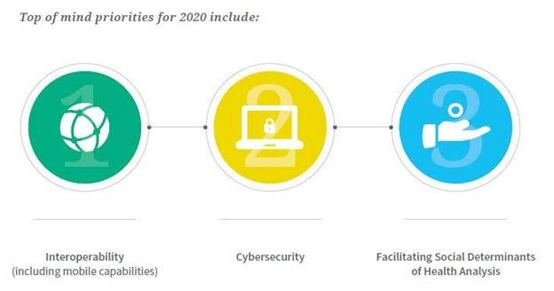

# Pandemics & Technology

## Technological impact of COVID-19
Since the world became familiar with the coronavirus, daily life has changed incomprehensibly. None of the planet's geology has been spared by the global pandemic. Nearly a year later, the bulk of us are at home using tools like Zoom and other modern advancements to stay in touch with friends and family. 

We frequently order groceries and medications online and have them delivered to our door. We now buy almost everything online. Innovation's importance in our lives is now more apparent than ever. Even though many developments and stages already existed before the epidemic, their importance to how we live our daily lives increased significantly during the pandemic. Following the epidemic, this is probably going to happen in a lot of places.

The general populace will be impacted by the epidemic. Innovation is one area where we will surely observe such effects, as it will unavoidably be impacted by the lessons learned during a unique and challenging moment in our collection of experiences.
The models that follow represent some of the major areas where the Coronavirus is changing the course of innovation, particularly in the realm of medical services, which includes wound care.

The purpose of this essay is to examine the development of innovation during the Coronavirus era and what it has meant for people's lives and states in a few developed and technologically advanced countries.

During Corona period, innovations were successful in automated transportation and online retail.

## Innovations have worked on internet shopping and automated conveyances during corona time 
After the flare-up of Coronavirus on the planet, innovative progression has been utilized to advance and empower the business to run all through. Coronavirus has changed web based shopping from periodic to a must worldwide to limit the development of individuals everywhere, in this manner controlling the Covid's spread. Internet shopping is upgraded through strong coordinated operations frameworks where robots are being utilized as the resources to convey food supplies and different items in light of the fact that in-person conveyance isn't resistant to infection. Nations like China and the US have sent off contactless conveyance administrations where the client's merchandise requested are élite and dropped off at the chose areas rather than the clients picking for themselves utilizing their hands. Nonetheless, few out of every odd area is equivalent concerning web based business in the midst of this pandemic. Critical varieties and changes in web-based conduct have been noticed (Figure 1). There is an impressive ascent in rush hour gridlock in certain areas, while others are seeing a huge diminishing in computerized visits.
 

## Remote healthcare and telemedicine
During the main months of the pandemic, the level of medical services meetings that were completed somewhat shot up from 0.1% to 43.5%. Experts at Deloitte say that the majority of us are content with this and will keep on utilizing virtual visits.
The cause behind the growth in remote medical care are clear, but even when excluding communicable diseases, there are several strong reasons to advance the ability to assess, diagnose, and treat patients remotely. In regions with limited access to healthcare, such as rural areas and places with a shortage of doctors, like India and China, this pattern holds the possibility the likelihood to protect lives by significantly growing clinical treatment. Wearable technologies of the new generation are outfitted with sensors for pulse, stress, and blood levels of oxygen, allowing medical care experts to screen essential signs continuously.The pandemic has also led to the creation of "virtual hospital wards" where centralized communication systems are used to manage the treatment of multiple patients, all from the comfort of their own homes. A more advanced version of this concept can be seen in the "Virtual ER" pilot project underway at the Pennsylvania Center for Emergency Medicine.

Telemedicine has the possibility of improving access to healthcare in a world where half the population is without access to essential services, according to the World Health Organization (WHO). Nonetheless, this is contingent on establishing trust with the public as some individuals still prefer an in-person interaction with healthcare providers. As a result, providers need to consider this when launching telemedicine services.

Planning for Medical services Advances Representing things to come

In 2020 , the WHO Territory of Nursing Report encouraged state run administrations and partners to put resources into training for medical attendants around arising medical care innovation. Computer generated reality, man-made consciousness, and telehealth are undeniably expected to keep developing inside medical services.
At last, there's no place to go except for forward. Medical services associations can't reject new innovation without likewise missing out on staffing and care valuable open doors. Organizations ought to embrace this second by coordinating new innovation where they can. Pioneers need to zero in on executing programming arrangements that will get them in a good position from now on. All in all, product stages that are proceeding to refresh alongside the business.
Also, welcoming medical attendants into the conversation is significant. Medical attendants have the right stuff and receptiveness to succeed with new devices. However, working with frameworks that aren't planned considering the client experience is debilitating. Medical caretakers have insight and understanding that can illuminate dynamic about new advances. It just appears to be legit to request their feedback.

## Technological Challenges
The primary challenge to the adoption of new technology in healthcare is the initial high error rate. New tech often requires extensive testing and refining before it can be considered reliable. This trial and error process can result in incorrect predictions and poor recommendations. For successful implementation, it is crucial for technologists and healthcare professionals to collaborate and prevent these issues from occurring. Until the technology is trustworthy, thorough testing and fail-safe measures must be implemented.

The pandemic has pushed new medical services innovation needs in front of old ones. 

The outcome of associated care starts with working on the quality and dependability of patient information. Something that medical care and clinical benefit suppliers of all sizes battle to keep up with, particularly now. Be that as it may, as worldwide innovation behemoths discuss versatile wellbeing records, individual wellbeing information trade and checking patient vitals through wearable gadgets, a sound portion of reality resounds among individuals accused of getting it going in the patient consideration climate. It should start with working on the exactness of patient information the executives.

Thusly, innovation objectives, for example, precise patient data, connected patient records, interoperability and network safety keep on being at the front of medical services concerns. The pandemic has just enhanced the requirement for these innovations to become real factors for suppliers and all through the more extensive medical care industry.Using Technology Solutions to Improve Remote Medical Care

 
With the transition to telemedicine and distant labor forces, the innovation focal point is much more centered around character the executives practices and security conventions for admittance to delicate medical care information. Permitting the ideal individual admittance to the right medical services records, and guaranteeing proper and patient-driven care, is more basic than any time in recent memory as the pandemic keeps on beating through the U.S. These innovation needs have not transformed, they've simply become more basic to guarantee legitimate worth based clinical consideration and to further develop medical care conveyance from suppliers.

## Conclusion
COVID-19 pandemic has greatly increased adoption of digital health solutions, which include telemedicine, remote observing, associated gadgets, advanced wellbeing stages, and wellbeing applications. These technologies have become crucial in the fight against the virus and have been used for online medical consultations, remote diagnosis and treatment, and remote monitoring of patients. Despite the benefits, there are still challenges to overcome, such as the digital divide and the security of personal health data, as well as questions over privacy and control of data. Overall, the impact of digital health on healthcare will continue to grow in the future.

### Reference : 
1. Technological impact of COVID-19
https://onlinelibrary.wiley.com/doi/10.1111/iwj.13578

2. Technologies have improved online shopping and robotic deliveries
https://journals.sagepub.com/doi/full/10.1177/20503121211000912

3. How artificial intelligence could help the fight against COVID-19
https://www.gavi.org/vaccineswork/how-artificial-intelligence-could-help-fight-against-covid-19

4. Remote healthcare and telemedicine
https://www.forbes.com/sites/bernardmarr/2022/01/10/the-five-biggest-healthcare-tech-trends-in-2022/
5. The rise of digital health technologies during the pandemic
https://www.europarl.europa.eu/thinktank/en/document/EPRS_BRI(2021)690548

6. Preparing for Healthcare Technologies of the Future
https://apploi.com/blog/hr-strategy/emerging-healthcare-technology/

7. Technological Challenges
 https://www.forbes.com/sites/forbestechcouncil/2022/01/11/the-future-of-healthcare-technology/

8. The pandemic has pushed new healthcare technology priorities ahead of old ones.https://risk.lexisnexis.com/insights-resources/research/covid-19-impact-on-healthcare-technology-priorities

### About Me
This is Sohanur Rahaman I’m a student studying Health Informatics in DIT, Germany. I’m currently living in Bangladesh. I love travelling, watching tv series, playing football.

Matriculation Number: 22205514 © 2023 Sohanur Rahaman