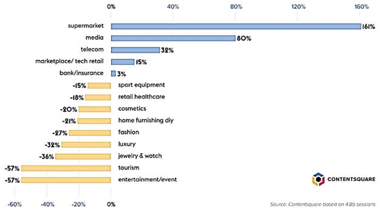
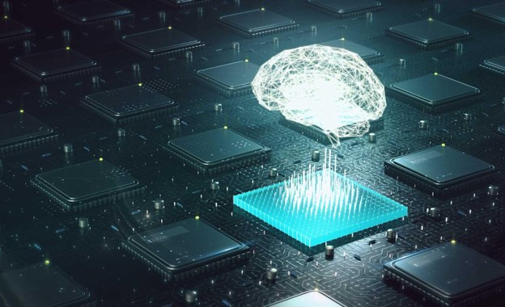
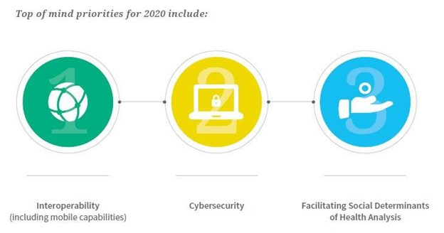

# Technological impact of COVID-19
Since COVID-19 was introduced to the world, daily life has undergone a tremendous transformation. Every region on earth has been affected by the worldwide epidemic. Nearly a year later, the majority of us are at home and use technologies like Zoom to stay in touch with friends, family, and coworkers. Almost everything we buy these days is ordered online and delivered right to our front door, even groceries and prescription drugs occasionally. Never before has the significance of technology in our lives been more obvious. Although there were many platforms and technologies before the epidemic, their significance to our day-to-day lives expanded dramatically during the pandemic. Following the epidemic, this is expected to continue in many places.

Our civilization will be affected by the pandemic for a while. Technology will unavoidably be impacted by the lessons discovered during an unprecedented and challenging moment in our history, therefore we may expect to see similar repercussions there.
The primary areas where COVID-19 is transforming technology's future, particularly in the field of health care and including wound care, are as follows.

Determining how the development of technology in this COVID-19 era has affected people's lives and the states of a few developed and technologically advanced countries is the focus of this essay.

## Technologies have improved online shopping and robotic deliveries during corona time 
Technology progress has been employed to promote and enable the firm to run continuously since the global COVID-19 outbreak. Online purchasing has become essential worldwide as a result of COVID-19 in order to reduce travel and stop the spread of the coronavirus. 3 Robust logistics systems that use robots to transport food supplies and other goods because person-to-person delivery is not virus-proof boost online purchasing. 

Contactless delivery services have been introduced in nations like China and the United States, allowing clients to purchase their goods and have them delivered to predetermined places rather than selecting them out with their hands. Despite this pandemic, not all sectors have equal access to e-commerce. Online behavior has seen significant variations and modifications in this following figure. In some industries, traffic has significantly increased, whereas it has significantly decreased in other industries.

## How artificial intelligence could help the fight against COVID-19

Machines and systems are providing fresh approaches to combating pandemics by utilizing big data and deep learning.

Artificial intelligence (AI) during an epidemic may sound like the sci-fi movie scenario of the future, but from the start of the COVID-19 epidemic, attempts have been made to apply the technology in numerous ways, frequently without being identified as "AI." Artificial intelligence generally involves teaching robots to acquire intelligence in the same way that people do, by leveraging human traits like foresight, logic, flexibility, creativity, and problem-solving. AI systems may one day prove helpful in a time-sensitive medical emergency since they are capable of adapting to continually changing data.

AI is currently being used by MIT and IBM researchers to develop new COVID-19 therapies. This method had already been refined to seek for novel antibiotics.

## Automated Diagnostics
Due to the COVID-19's symptoms' similarity to those of other illnesses, the diagnosis can be challenging, but it must be made immediately and accurately to ensure that patients receive the appropriate care.

Using an algorithm that was developed on more than 900 computerized tomography (CT) images of Chinese patients' lungs, researchers at Mount Sinai in New York developed an AI system that might assist in diagnosing COVID-19 patients. Because lung scans may look normal in the early stages of the illness and because the COVID-19-related lung issues may resemble those caused by other diseases, a diagnosis of the disease based solely on lung scans would not necessarily be appropriate. Naturally, this is why COVID-19 tests like SARS-CoV-2 antigen quick diagnostic tests and PCR tests are so helpful and why doctors undertake physical exams and patient interviews to compile a variety of data in order to make a diagnosis.

The AI system employs an algorithm that compares CT scans of a patient's lungs with information on age, bloodwork, symptoms, and potential virus interaction in an effort to predict what such an evaluation might show. Because of the system's increased effectiveness, 17 out of 25 individuals with normal-looking CT scans were determined to be positive for COVID-19, despite the fact that radiologists had previously categorized all of these patients as negative. With more testing and enhancements, this system might eventually prove to be a helpful tool for professionals caring for patients.

## Remote healthcare and telemedicine
The proportion of medical consultations conducted remotely increased dramatically from 0.1% to 43.5% in the early stages of the pandemic. Deloitte analysts claim that the majority of us are content with this and will keep using virtual visits.
The causes of this increase are evident, but even when communicable diseases are not a factor, there are many compelling arguments for developing the ability to remotely assess, diagnose, and treat patients. This movement has the potential to save lives by drastically increasing access to medical care in distant areas and nations where there is a shortage of doctors (like China and India).

By including heart rate, stress, and blood oxygen detectors in new generation wearable devices, healthcare providers can precisely track vital indicators in real-time. Even the creation of "virtual hospital wards" where centralized communication infrastructure is utilized to supervise the treatment of several patients, all of whom are in their homes, has been attributed to the pandemic. The "Virtual ER" pilot being developed at the Pennsylvania Center for Emergency Medicine is an improved version of this concept.

It's conceivable that by 2022, techniques developed during the pandemic to manage patients safely and remotely will have been applied to other facets of healthcare, including mental health and the provision of continued follow-up care for patients recuperating from major operations and illnesses. This movement is heavily influenced by robots and the Internet of Things, and smart technology (machine learning) will notify experts when sensors indicate that action is required or when cameras identify an old person who has fallen in their house.

In a society where half the population lacks access to basic services, telemedicine has the potential to increase access to healthcare (according to the WHO). But doing so depends on gaining the public's trust. Given that some individuals still prefer to meet with medical professionals in person, service providers must take this into account while implementing their programs.

## The rise of digital health technologies during the pandemic
The emergence of digital health, a wide concept that encompasses telemedicine and teleconsultation solutions, remote monitoring, connected devices, digital health platforms, and health apps, has been propelled by the coronavirus. The notion also includes the study and use of linked health data in big data-based systems, such as for epidemiological studies and diagnosis support with AI. The use of digital technologies is becoming increasingly important in the continuing pandemic response. They have been utilized, among other things, for telemedicine, which, like teleworking and online education, has been a fresh experience for many. This includes enhancing efficiency in patient diagnosis and treatment. 

Similarly, medical professionals have been diagnosing the infection using computerized technology. For instance, China has created brand-new e-health apps that enable users to remotely evaluate their Covid-19 symptoms. Because of the possibility of getting the virus, patients with serious illnesses have been able to have online consultations from home and, in some situations, be monitored remotely. Furthermore, the capacity to give repeat prescriptions remotely has been made possible by the availability of digital health data and e prescriptions in many EU nations, eliminating the need for unneeded patient-doctor interaction and lowering the risk of virus infection. Despite this, there are still numerous obstacles to be overcome because digital healthcare advancements have downsides. 

They draw attention to a growing "digital divide" that runs the risk of leaving behind the elderly and others from underprivileged backgrounds who are less able to learn or purchase the technology. In addition, given the surge in hospital cyberattacks, liability, reimbursement, and cybersecurity concerns are among the other significant difficulties that must be taken into account. In the meantime, concerns about people's privacy rights are being raised by the transfer of personal health data, which is generating a discussion over who owns and controls such data. Digital health is unquestionably here to stay.

## Preparing for Healthcare Technologies of the Future
The WHO State of Nursing Report recommended governments and stakeholders to fund nurses' education about cutting-edge medical technologies in 2020. Healthcare is predicted to see continued growth in telehealth, virtual reality, and artificial intelligence.
In the end, there is only one direction to take: forward. Without accepting new technologies, healthcare institutions risk missing out on staffing and care potential. Businesses should seize the opportunity by implementing new technologies wherever possible. Leaders must concentrate on implementing technology solutions that will position them for future success. In other words, platforms for software that are continuously updated to reflect industry changes.

It's crucial to include nurses in the debate as well. Nurses are open to learning new techniques and possess the necessary abilities. However, it is stressful to work with systems that weren't created with the user experience in mind. The knowledge and experience of nurses can help in decision-making regarding new technology. It is only logical to request their opinion.

## Technological Challenges
The first error rate is the biggest obstacle to new technology adoption in the healthcare sector. In general, iteration is necessary before new technical goods are sufficiently dependable. This difficult repetitive procedure could lead to incorrect predictions and unsuitable recommendations.

When implementing new technology, technologists and clinicians must work closely together to prevent this. Until sufficient reliability is established, they will need to thoroughly test new tools and identify fail-safe techniques.
Priorities for innovative healthcare technologies have been elevated due to the epidemic.

The success of linked care depends on patient data that is more accurate and reliable. Especially in the current climate, something that healthcare and medical service providers of all sizes fight to retain. A good dose of reality, however, resonates among those in charge of making it happen in the patient care setting as global technology behemoths speak of wearable devices, personal health data interchange, and mobile health records. The management of patient data accuracy must be improved first. 

As a result, technology objectives including security, interoperability, linked patient data, and accurate patient information continue to be at the top of healthcare issues. The epidemic has only increased the demand for these technologies to become commonplace among healthcare providers and the larger sector.

## Using Technology Solutions to Improve Remote Medical Care

Technology is increasingly focusing on identity management procedures and security regulations for access to sensitive healthcare data as telemedicine and remote workforces become more prevalent. As the epidemic spreads through the U.S., it is more important than ever to grant the appropriate individual access to the relevant healthcare information and to ensure appropriate, patient-centered care. These technological requirements have not altered; on the contrary, they have simply become more pressing in order to guarantee effective value-based medical care and enhance provider healthcare delivery.

The epidemic has also increased our need for technology to monitor societal elements that have an impact on patient health and to comprehend how such factors affect healthcare outcomes and access. The inclusion of socioeconomic determinants of health in care planning was elevated by COVID-19. According to data, the virus particularly affected vulnerable individuals and moved fast through densely populated places. These inequities can be addressed, and vulnerable patients can receive better medical treatment, by incorporating social determinants of health data into care models.

## Conclusion
In conclusion, pandemics have had a profound impact on the world, leading to a shift in the way we live and work. The COVID-19 pandemic in particular has accelerated the adoption of technology, as people were forced to rely on digital tools to stay connected and carry out daily tasks. The increased use of technology has had both positive and negative effects, improving access to information and services, but also leading to increased privacy and security concerns. As we move forward, it's important to continue to harness the power of technology to help us recover from the pandemic, while also being mindful of its potential drawbacks.

### Reference : 
1. Technological impact of COVID-19
https://onlinelibrary.wiley.com/doi/10.1111/iwj.13578

2. Technologies have improved online shopping and robotic deliveries
https://journals.sagepub.com/doi/full/10.1177/20503121211000912

3. How artificial intelligence could help the fight against COVID-19
https://www.gavi.org/vaccineswork/how-artificial-intelligence-could-help-fight-against-covid-19

4. Remote healthcare and telemedicine
https://www.forbes.com/sites/bernardmarr/2022/01/10/the-five-biggest-healthcare-tech-trends-in-2022/
5. The rise of digital health technologies during the pandemic
https://www.europarl.europa.eu/thinktank/en/document/EPRS_BRI(2021)690548

6. Preparing for Healthcare Technologies of the Future
https://apploi.com/blog/hr-strategy/emerging-healthcare-technology/

7. Technological Challenges
 https://www.forbes.com/sites/forbestechcouncil/2022/01/11/the-future-of-healthcare-technology/

8. The pandemic has pushed new healthcare technology priorities ahead of old ones.https://risk.lexisnexis.com/insights-resources/research/covid-19-impact-on-healthcare-technology-priorities

### About Me
This is Sohanur Rahaman I’m a student studying Health Informatics in DIT, Germany. I’m currently living in Bangladesh. I love travelling, watching tv series, playing football.

Matriculation Number: 22205514 © 2023 Sohanur Rahaman